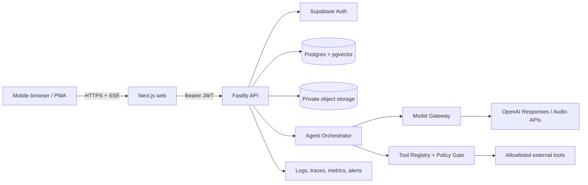

# VARIS — Architecture Plan

**Status:** Planning only (no application code, final UI, or voice implementation in this phase)  
**Date:** 2026-09-18  
**Scope:** Conversational AI assistant with text first; voice, tools, memory, security, and responsive/mobile-first delivery are designed as compatible future capabilities.

## 1. Product requirements and boundaries

VARIS needs authenticated one-to-one conversations, streaming text replies, durable conversation history, optional long-term memory, tool/function calling, voice input/output, voice style controls, and a cinematic intro/orb experience. The first build should establish the text conversation contract, data model, provider abstraction, observability, and security boundaries.

This phase deliberately excludes final visual design, voice feature implementation, custom voice enrollment, production tool integrations, and application code. Voice is specified as an adapter contract so it can be added without changing chat or agent persistence.

Non-functional targets: mobile-first responsive layout, keyboard/screen-reader accessibility, resumable streams, idempotent writes, predictable latency, provider substitution, least-privilege access, auditable agent actions, and deletion/export of user data.

## 2. Recommended technology stack

| Layer | Decision | Reason and compatibility |
|---|---|---|
| Frontend | Next.js App Router + TypeScript + React + Tailwind CSS; installable PWA | SSR/streaming, responsive web and mobile browser support, one codebase, easy future native client against the same API. Next.js currently requires Node.js 20.9+ and recommends App Router. |
| Backend | Separate Fastify 5 TypeScript service on Node.js 22/24 LTS | Keeps provider secrets and tool execution off the client; Fastify has schema validation, streaming support, and a clear plugin model. Pin compatible minor versions and use the supported Node LTS line. |
| Database | Supabase PostgreSQL; `pgvector` extension | Relational integrity for chat/agent data, vector search for memory, managed backups and migrations. |
| Auth | Supabase Auth (email/password, magic link, OAuth; MFA optional) | JWT sessions integrate with Postgres RLS. Browser receives only the publishable key; service role stays backend-only. |
| Object storage | Supabase Storage private buckets (or S3-compatible provider behind a storage adapter) | Audio, consent files, exports, and avatars never live in the database; use short-lived signed URLs. |
| AI orchestration | Provider-neutral `ModelGateway`; OpenAI Responses API initially | Responses supports streaming, structured output, and typed function calls. Use `gpt-5.6-terra` as the balanced default and a configurable stronger model for complex tasks. |
| STT (later) | OpenAI `gpt-transcribe` for completed clips; Realtime transcription for live microphone streams | Same provider and SDK family as the agent layer; file and live flows have explicit adapters. |
| TTS (later) | OpenAI `gpt-4o-mini-tts` with built-in voice IDs and instructions | Supports streaming audio and controllable tone, speed, intonation, and emotion. |
| Realtime transport (later) | WebRTC from client to a backend-issued ephemeral session, or backend WebSocket relay when server-side tool control is required | WebRTC minimizes latency; backend remains the authority for identity, tools, limits, and persistence. |
| Validation | JSON Schema via Fastify type provider (TypeBox or Zod adapter) | Request/response contracts are enforced at the edge and shared as TypeScript types. |
| Tests/ops | Vitest, Supertest, Playwright, contract tests, OpenTelemetry-compatible tracing, Sentry-compatible error tracking | Covers deterministic services, API behavior, browser flows, and provider failures. |

The frontend must never call OpenAI or a privileged database endpoint directly. All model, audio, tool, and memory operations go through the backend.

## 3. High-level architecture



The API owns authorization, idempotency, persistence, provider calls, and tool policy. The UI owns presentation, optimistic state, stream cancellation, and accessible interaction states.

## 4. AI model and API layer

`ModelGateway` exposes `respond()`, `stream()`, `embed()`, `transcribe()`, and `synthesize()` interfaces. Provider model IDs live in environment/config, not in UI code. Persist the selected model ID and prompt version with every run for reproducibility.

Initial model policy:

- General text and agent reasoning: `gpt-5.6-terra`; allow a stronger configured model for complex workflows and a lower-cost model for high-volume classification/summarization.
- Tool calls: Responses API function tools with JSON Schema arguments; validate arguments again on the server before execution.
- Embeddings: `text-embedding-3-small` (dimension must match the `memory_items.embedding` column; make dimension a migration/config constant).
- Safety: moderation/policy checks before tool execution and before storing durable memories; redact secrets and sensitive fields from traces.
- Set `store: false` unless a deliberate retention policy requires provider-side state. VARIS stores canonical conversation state in its own database.

The gateway must normalize provider errors, support retries only for safe/idempotent operations, enforce timeouts and token budgets, and emit usage metadata.

## 5. Speech and voice design (future phase)

### STT

For push-to-talk or uploaded clips, upload to a private bucket, scan/type-check and limit duration/size, then call `gpt-transcribe`. For continuous conversation, use Realtime transcription with VAD and partial/final transcript events. Persist only the final transcript by default; raw audio retention is opt-in and deletable.

### TTS and voice style

Use `gpt-4o-mini-tts` with a selected built-in voice plus a constrained style object (`tone`, `pace`, `energy`, `language`). Map style values to a server-owned prompt; do not accept arbitrary unbounded instructions from the client. Stream audio in chunks and persist only metadata unless the user asks to save audio.

### Safe voice adaptation/cloning

Default to built-in voices and style controls. A custom voice is permitted only after: (1) the speaker is the verified account owner or has documented authorization, (2) a separate consent recording uses the provider-required consent phrase, (3) the sample matches the consenting speaker, (4) the user accepts terms and a visible synthetic-voice disclosure is enabled, and (5) the voice can be revoked and deleted. Store consent status, evidence object key, actor, timestamp, provider voice ID, and audit events; encrypt access and never expose raw samples publicly. OpenAI custom voices are restricted to eligible customers and require separate consent and sample recordings, so the feature must remain disabled behind a capability flag until eligibility and legal review are complete.

## 6. Agent architecture

The orchestrator is a bounded state machine:

1. Authenticate request and load conversation summary plus relevant memory.
2. Build a versioned system prompt and tool manifest from the user/agent configuration.
3. Call the model with streaming enabled.
4. If a tool call is returned, validate schema, check user consent and policy, apply rate/budget limits, execute in a sandbox/adapter, record the call, and send the result back to the model.
5. Stop after a configurable tool/turn budget; produce a safe final answer and persist all events.

Tools are registered with name, version, JSON Schema, risk level, required scopes, timeout, idempotency behavior, and redaction rules. High-risk actions require an explicit confirmation event. Tool results are untrusted data and are delimited before being returned to the model. No arbitrary shell, SQL, network, or credential access is exposed to the model.

## 7. Memory system

Use three layers:

- **Working memory:** current request, recent turns, tool results, and a rolling conversation summary.
- **Semantic memory:** user-approved facts/preferences stored as small records with embeddings, source message, confidence, sensitivity, and expiry.
- **Episodic/audit memory:** immutable agent/tool events used for traceability, not automatically injected into prompts.

On each turn, retrieve top-k semantic memories filtered by `user_id`, scope, sensitivity policy, and recency. Apply a token budget and deduplicate. Only write a durable memory when a classifier/policy marks it useful and the user setting permits it; allow “remember this”, edit, export, and delete. Never store credentials, authentication tokens, raw consent audio, or inferred sensitive traits as normal memory.

## 8. Authentication and authorization

Supabase Auth issues short-lived JWT access tokens and refresh sessions. Fastify verifies the token and maps `sub` to `profiles.id`; every repository query includes tenant/user scope. Enable RLS on all exposed tables, use `auth.uid()` policies, and keep service-role credentials only in the backend. Add optional MFA for sensitive operations (voice enrollment, exports, account deletion, high-risk tools). Rate-limit anonymous, authenticated, model, audio, and tool routes separately.

## 9. API architecture

Base path: `/v1`. JSON uses RFC 7807-style errors (`type`, `title`, `status`, `code`, `detail`, `request_id`). All mutation requests accept an `Idempotency-Key`.

Core routes:

- `GET /health/live`, `GET /health/ready`
- `GET /v1/me`, `PATCH /v1/me/preferences`
- `GET/POST /v1/conversations`, `GET/PATCH/DELETE /v1/conversations/:id`
- `GET /v1/conversations/:id/messages`
- `POST /v1/conversations/:id/runs` (stream text/events via SSE; cancel endpoint)
- `GET/POST/PATCH/DELETE /v1/memories`
- `GET /v1/agents`, `POST /v1/agents/:id/runs`
- Future: `POST /v1/audio/transcriptions`, `POST /v1/audio/speech`, `POST /v1/voice-sessions`

SSE event types: `run.started`, `message.delta`, `tool.started`, `tool.completed`, `message.completed`, `run.failed`, `run.cancelled`. Event IDs permit reconnect/resume. WebRTC session endpoints return only short-lived provider credentials and capability-limited configuration.

## 10. Database schema

All IDs are UUIDs; all tables have `created_at` and relevant `updated_at`; timestamps are UTC. Foreign keys use restrictive deletes unless explicitly stated.

| Table | Key columns |
|---|---|
| `profiles` | `id = auth.users.id`, display name, locale, timezone, status |
| `user_preferences` | `user_id`, theme, voice_enabled, memory_enabled, retention_days, style JSON |
| `agents` | `id`, owner `user_id`, name, system_prompt, model_id, prompt_version, status |
| `agent_tools` | `agent_id`, tool_name/version, config JSON, enabled, risk_level |
| `conversations` | `id`, `user_id`, `agent_id`, title, status, summary, last_message_at |
| `messages` | `id`, `conversation_id`, `user_id`, role, content, content_json, status, provider_message_id, sequence_no |
| `agent_runs` | `id`, `conversation_id`, `user_id`, model_id, prompt_version, status, input/output token counts, error_code, started/finished_at |
| `run_events` | `id`, `run_id`, sequence, type, payload JSON, redacted_at |
| `tool_calls` | `id`, `run_id`, `agent_tool_id`, arguments JSON, result JSON, status, approval, latency, error_code |
| `memory_items` | `id`, `user_id`, scope, kind, text, embedding vector, source_message_id, confidence, sensitivity, expires_at, deleted_at |
| `audio_assets` | `id`, `user_id`, storage_key, media_type, duration_ms, sha256, retention_until, status |
| `transcripts` | `id`, `audio_asset_id`, `user_id`, text, language, provider, segments JSON |
| `voice_profiles` | `id`, `user_id`, provider, provider_voice_id, kind, status, style JSON, consent_id |
| `voice_consents` | `id`, `user_id`, voice_profile_id, consent_storage_key, sample_storage_key, consent_phrase, verified_at, revoked_at |
| `usage_records` | `id`, `user_id`, `run_id`, provider, model, token/audio units, cost_estimate |
| `audit_logs` | `id`, `user_id`, actor, action, resource_type/id, metadata JSON, request_id |

Indexes: `(user_id, last_message_at)`, `(conversation_id, sequence_no)`, `(run_id, sequence)`, `(user_id, created_at)`, partial index on active memories, and HNSW/IVFFlat on `memory_items.embedding` after the embedding dimension is fixed. RLS policies isolate every user-owned row; only backend service roles can write provider credentials or consent verification fields.

Relationships: one profile owns many agents, conversations, memories, assets, and audit records; one agent has many tools and conversations; one conversation has many messages and runs; one run has many events and tool calls; one audio asset has zero or one transcript; one voice profile has zero or one active consent record and many audit events; messages may source memory items.

## 11. Text chat flow

1. Client obtains/refreshes Supabase session and opens a conversation.
2. Client sends `POST /runs` with message text, client nonce, and optional attachments.
3. API verifies JWT, conversation ownership, quotas, input size, and idempotency key; persists the user message.
4. Memory service summarizes/retrieves context; orchestrator calls Responses API.
5. API emits SSE deltas, tool events, and completion; client can reconnect using `Last-Event-ID`.
6. Server transaction persists the assistant message, run metrics, summary update, and eligible memory candidates.
7. Cancellation marks the run and stops downstream work; partial output is labeled incomplete.

## 12. Voice conversation flow (future)

1. Client requests a voice session; backend authorizes feature, voice profile, locale, quota, and consent disclosure.
2. Backend returns a short-lived WebRTC/session credential or an upload URL.
3. Audio frames go to the transcription adapter; partial text is shown locally, final text is persisted as a message/transcript.
4. The same agent orchestrator handles memory and tools.
5. TTS streams the final answer with selected safe style/voice; interruption cancels audio and returns to listening.
6. Store audio only under explicit retention settings, with deletion and audit support.

## 13. Error handling and resilience

Use stable error codes: `AUTH_REQUIRED`, `FORBIDDEN`, `VALIDATION_FAILED`, `RATE_LIMITED`, `QUOTA_EXCEEDED`, `PROVIDER_TIMEOUT`, `PROVIDER_UNAVAILABLE`, `TOOL_DENIED`, `TOOL_FAILED`, `RUN_CANCELLED`, `VOICE_CONSENT_REQUIRED`, and `INTERNAL_ERROR`. Return a user-safe message plus `request_id`; log provider details server-side. Retry exponential-backoff only for idempotent transient failures, use circuit breakers per provider, cap tool loops, and provide a text fallback when voice fails. Never silently replay a non-idempotent tool.

## 14. Security architecture

- TLS everywhere; strict CORS to the web origin; secure, HttpOnly, SameSite session cookies where applicable.
- Secrets only in environment/secret manager: `SUPABASE_URL`, `SUPABASE_PUBLISHABLE_KEY`, `SUPABASE_SERVICE_ROLE_KEY` (backend only), `OPENAI_API_KEY`, storage credentials, `SENTRY_DSN`, and rate-limit/telemetry keys. Provide `.env.example` with names only; never commit values.
- Validate size, MIME, encoding, and content of text/JSON/audio; virus/content scan uploads; use signed URLs and bucket policies.
- RLS plus backend authorization; do not trust client claims, model output, tool arguments, or tool results.
- Prompt-injection defenses: delimit retrieved/tool content, allowlist tools/domains, require confirmation for risky actions, and never put secrets in prompts.
- Redact PII/secrets from logs; encrypt data at rest; define retention/deletion/export workflows; maintain audit logs for auth, tools, voice consent, and admin actions.
- Apply OWASP API and LLM controls, dependency scanning, secret scanning, CSP, security headers, CSRF protection for cookie mutations, and supply-chain lockfiles.

## 15. Testing strategy

- **Unit:** prompt builder, memory ranking/redaction, policy gate, error mapping, idempotency, style mapping, and repository authorization.
- **Contract:** OpenAPI/JSON Schema tests for every route and SSE event; provider adapters tested against recorded fixtures, never live keys in CI.
- **Integration:** ephemeral Postgres/Supabase project with migrations, RLS tests for cross-user access, transaction and retry tests.
- **Agent evals:** golden conversations for factuality, tool selection, argument validity, refusal, prompt injection, latency, and token budgets; regression set versioned with prompts/models.
- **Browser E2E:** sign-in, create/send/stream/cancel/reconnect, responsive breakpoints, accessibility keyboard flow, and offline/error states using mocked provider responses.
- **Voice later:** deterministic fixtures for VAD/STT/TTS, consent rejection/revocation, interruption, audio limits, and no-audio-retention settings.
- **Security/performance:** SAST, dependency/license scan, secret scan, DAST, rate-limit tests, load tests for concurrent SSE/WebRTC sessions, and chaos tests for provider/database outages.

## 16. Folder structure (planned)

```text
varis/
├─ apps/
│  ├─ web/                         # Next.js App Router/PWA
│  │  ├─ app/                      # routes, layouts, loading/error boundaries
│  │  ├─ components/               # presentational UI (final UI later)
│  │  ├─ features/chat/            # chat state and stream client
│  │  ├─ lib/api-client/           # typed API client, no provider secrets
│  │  └─ public/                   # future intro/orb assets
│  └─ api/                         # Fastify service
│     └─ src/
│        ├─ server.ts
│        ├─ plugins/                # auth, db, config, telemetry
│        ├─ routes/v1/              # HTTP/SSE route handlers
│        ├─ modules/                # conversations, agents, memory, audio
│        ├─ agent/                  # orchestrator, policies, tool registry
│        ├─ providers/               # OpenAI and future provider adapters
│        ├─ repositories/            # database access only
│        └─ shared/                  # schemas, errors, logger, types
├─ packages/
│  ├─ contracts/                    # OpenAPI/JSON Schema + generated types
│  ├─ config/                       # validated env schema, no secrets committed
│  └─ test-fixtures/                # safe prompts/audio metadata, no personal data
├─ supabase/
│  ├─ migrations/
│  ├─ seed.sql                      # non-sensitive development data
│  └─ tests/                        # RLS and database tests
├─ docs/
│  ├─ architecture.md
│  ├─ api.md
│  ├─ threat-model.md
│  └─ decisions/                    # ADRs
├─ .env.example
├─ package.json
├─ pnpm-workspace.yaml
└─ README.md
```

## 17. Delivery sequence after approval

1. Freeze this architecture and write ADRs for provider, auth, storage, and model choices.
2. Create workspace/package skeleton and validated environment contract only.
3. Add database migrations, RLS, repository tests, and auth middleware.
4. Implement text chat route, streaming contract, persistence, and agent/tool policy with mock tools.
5. Implement web chat UX and intro/orb design as a separate UI milestone.
6. Add memory controls and evaluation harness.
7. Add STT/TTS adapters, then realtime voice; custom voice only after consent/eligibility review.

## References

- [OpenAI Responses API and function calling](https://developers.openai.com/api/docs/guides/function-calling) — streaming and typed custom tools.
- [OpenAI model catalog and GPT-5.6 Terra](https://developers.openai.com/api/docs/models/gpt-5.6-terra) — modalities, endpoints, function calling, structured output.
- [OpenAI speech-to-text](https://developers.openai.com/api/docs/guides/speech-to-text) — `gpt-transcribe` and realtime transcription.
- [OpenAI text-to-speech](https://developers.openai.com/api/docs/guides/text-to-speech) — `gpt-4o-mini-tts`, voices, and style instructions.
- [OpenAI custom voices](https://developers.openai.com/api/docs/guides/custom-voices) — eligibility, consent recording, sample requirements.
- [OpenAI data controls](https://developers.openai.com/api/docs/guides/your-data) — retention and `store` behavior.
- [OpenAI embeddings](https://developers.openai.com/api/docs/guides/embeddings) and [Supabase pgvector](https://supabase.com/docs/guides/database/extensions/pgvector).
- [Supabase Auth](https://supabase.com/docs/guides/auth) and [Row Level Security](https://supabase.com/docs/guides/database/postgres/row-level-security).
- [Next.js installation/system requirements](https://nextjs.org/docs/app/getting-started/installation).
- [Fastify LTS](https://fastify.dev/docs/latest/Reference/LTS/) and [validation/serialization](https://fastify.dev/docs/latest/Reference/Validation-and-Serialization/).
- [Node.js release policy](https://nodejs.org/en/about/previous-releases).
- [OWASP Top 10 for LLM applications](https://owasp.org/projects/top-10-for-large-language-model-applications).
